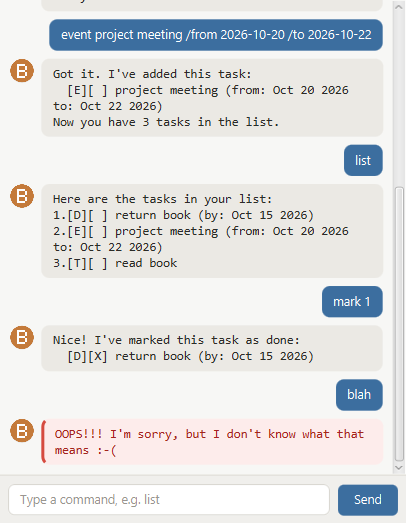

# Bucket User Guide



**Bucket** is a desktop app for keeping track of the things you have to do. You
talk to it by typing, so if you can type quickly you can add and find tasks
faster than with a mouse-driven to-do list.

Bucket handles three kinds of task:

- **todos** — something to do, with no date attached
- **deadlines** — something due *by* a date
- **events** — something running *from* one date *to* another

---

## Quick start

1. Make sure you have **Java 25** installed.
2. Download `bucket.jar`.
3. Open a terminal in the folder you put it in and run:
   ```
   java -jar bucket.jar
   ```
4. Type a command into the box at the bottom and press **Enter**.

Try `todo read book` to get started, then `list` to see it.

---

## Features

### Adding a todo

Adds a task with no date.

```
todo DESCRIPTION
```

Example: `todo read book`

```
Got it. I've added this task:
  [T][ ] read book
Now you have 1 tasks in the list.
```

### Adding a deadline

Adds a task that is due by a date.

```
deadline DESCRIPTION /by YYYY-MM-DD
```

Example: `deadline return book /by 2026-10-15`

```
Got it. I've added this task:
  [D][ ] return book (by: Oct 15 2026)
Now you have 2 tasks in the list.
```

### Adding an event

Adds a task that runs between two dates.

```
event DESCRIPTION /from YYYY-MM-DD /to YYYY-MM-DD
```

Example: `event project meeting /from 2026-10-20 /to 2026-10-22`

```
Got it. I've added this task:
  [E][ ] project meeting (from: Oct 20 2026 to: Oct 22 2026)
Now you have 3 tasks in the list.
```

> **Dates must be written as `YYYY-MM-DD`**, so the 15th of October 2026 is
> `2026-10-15`. Anything else is turned away.

### Listing your tasks

Shows everything, **earliest first**. Todos have no date, so they sit at the end.

```
list
```

```
Here are the tasks in your list:
1.[D][ ] return book (by: Oct 15 2026)
2.[E][ ] project meeting (from: Oct 20 2026 to: Oct 22 2026)
3.[T][ ] read book
```

The number in front of each task is what `mark`, `unmark` and `delete` use, so
run `list` first if you are not sure which number you want.

### Marking a task as done

```
mark TASK_NUMBER
```

Example: `mark 1`

```
Nice! I've marked this task as done:
  [D][X] return book (by: Oct 15 2026)
```

A done task shows `[X]` instead of `[ ]`.

### Marking a task as not done

```
unmark TASK_NUMBER
```

Example: `unmark 1`

```
OK, I've marked this task as not done yet:
  [D][ ] return book (by: Oct 15 2026)
```

### Finding tasks

Shows every task whose description contains the keyword. Capitals do not matter,
so `find BOOK` finds `read book`.

```
find KEYWORD
```

Example: `find book`

```
Here are the matching tasks in your list:
1.[D][ ] return book (by: Oct 15 2026)
2.[T][ ] read book
```

> These results are numbered from 1 on their own. They are **not** the numbers to
> use with `mark` or `delete` — run `list` for those.

### Deleting a task

```
delete TASK_NUMBER
```

Example: `delete 3`

```
Noted. I've removed this task:
  [T][ ] read book
Now you have 2 tasks in the list.
```

### Leaving

```
bye
```

```
BYEEEEEEE!
```

The window closes a moment later.

---

## Your tasks are saved automatically

Bucket writes your list to `data/bucket.txt` after **every** command, so there
is nothing to save by hand. Close the window whenever you like and everything
will be there next time.

That folder is created in whichever directory you start Bucket from, so run it
from the same place each time and it will always find your tasks.

---

## When something goes wrong

Bucket answers in red rather than doing something you did not ask for. The
common ones:

| Message | What it means |
| --- | --- |
| `OOPS!!! The description of a todo cannot be empty.` | You typed `todo` with nothing after it. |
| `OOPS!!! Dates need to look like 2019-10-15.` | The date was not in `YYYY-MM-DD` form. |
| `OOPS!!! That command is missing a part.` | A `/by`, `/from` or `/to` is missing. |
| `OOPS!!! I need a task number, e.g. mark 2.` | You gave a word where a number belongs. |
| `OOPS!!! There is no task with that number.` | No task is numbered that. Run `list` to check. |
| `OOPS!!! I'm sorry, but I don't know what that means :-(` | The command word was not recognised. |

Nothing is added or changed when a command is refused, so it is safe to correct
it and try again.

---

## Command summary

| Action | Format | Example |
| --- | --- | --- |
| Add todo | `todo DESCRIPTION` | `todo read book` |
| Add deadline | `deadline DESCRIPTION /by YYYY-MM-DD` | `deadline return book /by 2026-10-15` |
| Add event | `event DESCRIPTION /from YYYY-MM-DD /to YYYY-MM-DD` | `event meeting /from 2026-10-20 /to 2026-10-22` |
| List all | `list` | `list` |
| Mark done | `mark TASK_NUMBER` | `mark 1` |
| Mark not done | `unmark TASK_NUMBER` | `unmark 1` |
| Find | `find KEYWORD` | `find book` |
| Delete | `delete TASK_NUMBER` | `delete 3` |
| Exit | `bye` | `bye` |

Command words are lower case: `todo` works, `TODO` does not.
